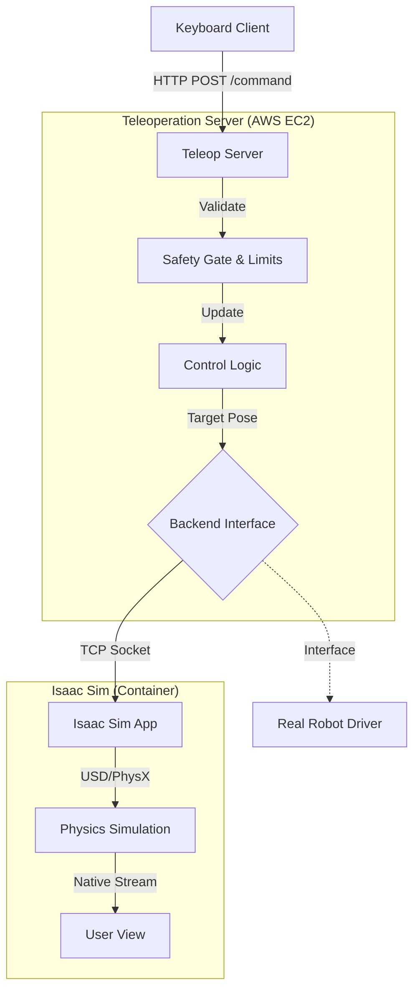

# Cloud-Based Robot Teleoperation Platform (Simulation Only)

## Overview
This project implements a cloud-native teleoperation system that allows a remote client to control a robot arm (Franka Emika Panda) in NVIDIA Isaac Sim. The system is designed with a clean separation of concerns, safety mechanisms, and cloud-ready architecture.

## System Architecture

The system consists of three main components:

1. **Teleoperation Server (Core)**: A FastAPI-based server that handles client commands, enforces safety/velocity limits, and manages the robot backend.
2. **Robot Backend**: An abstraction layer that communicates with the physical robot or simulation. Currently implements `IsaacSimBackend` (via TCP) and `MockBackend`.
3. **Client**: A Python-based keyboard client that sends incremental delta commands.



## Features

- **Incremental Control**: Users control the robot via delta commands (dx, dy, droll, etc.) rather than absolute poses.
- **Safety First**:
  - **Deadman Switch**: Commands must be sent continuously (heartbeat). If no command is received for 0.5s, the robot stops.
  - **Velocity Limiting**: Commands are clamped to safe linear and angular velocities.
  - **Workspace Limits**: The robot is constrained to a safe 3D bounding box.
- **Backend Abstraction**: The server is agnostic to the robot implementation. Switching to a real robot only requires implementing a new `RobotBackend` subclass.
- **Cloud Native**: Fully containerized using Docker and Docker Compose, ready for AWS deployment.
- **Livestreaming**: Supports NVIDIA Omniverse Native Streaming for high-performance remote visualization.

## Directory Structure

```
teleop_system/
├── client/                 # Client applications
│   └── keyboard_client.py  # Minimal keyboard teleop client
├── server/                 # Teleoperation Server (Core)
│   ├── backends/           # Robot backend implementations
│   │   ├── isaac_backend.py
│   │   └── mock_backend.py
│   ├── teleop_server.py    # FastAPI entry point
│   ├── control_logic.py    # Kinematics and limit logic
│   ├── safety_gate.py      # Deadman switch and velocity limits
│   ├── robot_backend.py    # Abstract base class
│   └── models.py           # Pydantic data models
├── deployment/             # Infrastructure as Code
│   ├── docker-compose.full.yml
│   └── deploy_remote.sh
├── isaac_sim_client.py     # Isaac Sim standalone script
└── requirements.txt
```

## Getting Started

### Prerequisites
- Docker & Docker Compose
- NVIDIA GPU with Drivers (for Isaac Sim)
- Python 3.8+

### Running Locally

1. **Start the System**:
   ```bash
   # Start Server and Isaac Sim
   docker-compose -f deployment/docker-compose.full.yml up -d
   ```

2. **Connect Client**:
   ```bash
   # Install client dependencies
   pip install requests

   # Run keyboard client
   python client/keyboard_client.py
   ```

3. **View Simulation**:
   - Use **Omniverse Streaming Client** to connect to `localhost`.

### Controls

- **W/S**: Up/Down (Z)
- **A/D**: Left/Right (X)
- **Q/E**: Forward/Backward (Y)
- **I/K**: Pitch
- **J/L**: Yaw
- **U/O**: Roll
- **1**: Force Activate Safety
- **R**: Reset

## AWS Deployment

1. **Launch EC2 Instance**:
   - Instance Type: `g4dn.xlarge` (or better)
   - AMI: Ubuntu 22.04 Deep Learning AMI
   - Security Group: Allow TCP 8000 (API), 49100 (Stream Signal), 47998 (Stream Video).

2. **Deploy**:
   ```bash
   # SSH into instance
   ssh -i key.pem ubuntu@<IP>

   # Clone repo
   git clone <repo_url>
   cd teleop_system

   # Run deployment script
   bash deployment/deploy_remote.sh
   ```

3. **Connect**:
   - Use Omniverse Streaming Client to connect to `<EC2_Public_IP>`.
   - Run `client/keyboard_client.py --url http://<EC2_Public_IP>:8000`.

## Design Notes & Tradeoffs

See [DESIGN.md](DESIGN.md) for detailed architectural decisions and future improvements.
