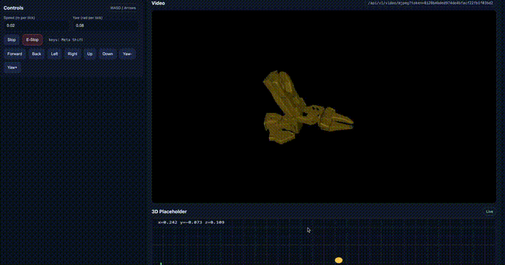

# DRT: Distributed Robot Teleoperation Platform

[](LICENSE)

DRT is a universal, cloud-native teleoperation system designed to bridge the gap between simulation and real-world robotic manipulation. It supports heterogeneous embodiments (6-DoF/7-DoF), multiple input methods (VR, Keyboard, Joystick), and seamless switching between local and cloud environments.



## 🌟 Key Features

### 🎮 Multi-Modal Inputs
*   **VR Control:** Full 6-DoF control with stereoscopic vision (Quest 3/3S via WebXR).
*   **Keyboard & Mouse:** Accessible browser-based control for quick testing.
*   **Joystick:** Xbox/Gamepad support for intuitive operation.

### 🤖 Universal Embodiment Support
*   **Heterogeneous Robots:** Supports 6-DoF (e.g., SO-ARM101) and 7-DoF (e.g., Realman RM65) arms.
*   **Unified Interface:** Abstracted backend allows controlling different robots with the same client.
*   **Supported Hardware:**
    *   **SO-ARM101** (6-DoF)
    *   **Realman RM65/RM75** (7-DoF)
    *   **Lingyu** (URDF support)

### 🌍 Simulation & Real World
*   **MuJoCo (Step 1):** Fast, local physics simulation for rapid development and testing.
*   **Isaac Sim (Step 2):** High-fidelity, photorealistic simulation (Local or Cloud via Omniverse Streaming).
*   **Sim-to-Real:** Identical control stack for simulation and physical hardware.

### 📱 Cross-Platform
*   **Server:** Linux (Ubuntu), macOS.
*   **Client:** Any web browser (Desktop, Android, VR headsets).
*   **Android Support:** Control via mobile browser or dedicated app (planned).

## 🚀 Scenarios
*   **Research:** Universal platform for teleoperation data collection.
*   **Logistics:** Box sorting and handling (e.g., Amazon return processing).
*   **Remote Operation:** Low-latency control over public internet.

## ⚡ Quick Start

For detailed installation and usage instructions, please see the [Quick Start Guide](QUICKSTART.md).

### 1. Installation
```bash
git clone https://github.com/your-org/drt.git
cd drt
pip install -r requirements.txt
```

### 2. Run Simulation (MuJoCo)
```bash
python server/teleop_server.py --backend mujoco
```

### 3. Open Client
Open `http://localhost:3000` in your browser.

## 📚 Documentation

Detailed guides can be found in the `docs/` directory:

*   **Setup:** [VR Setup](docs/VR_SETUP.md), [Real Robot Setup](docs/SOARM_SETUP.md)
*   **Operation:** [Keyboard Controls](docs/KEYBOARD_CONTROLS.md), [Quest 3 Sync](docs/QUEST3_SYNC.md)
*   **Deployment:** [AWS Deployment](docs/AWS_DEPLOYMENT.md), [Isaac Sim Workflow](docs/ISAAC_SIM_WORKFLOW.md)
*   **Validation:** [Latency Testing](docs/LATENCY_TESTING.md), [Local Validation](docs/LOCAL_VALIDATION.md)

## 📄 License

This project is licensed under the Apache License 2.0 - see the [LICENSE](LICENSE) file for details.

## 🙏 Acknowledgements

*   **NVIDIA:** For Isaac Sim and investment support.
*   **OpenTelevision:** For inspiration on teleoperation frameworks.
*   **Realman & Lingyu:** For hardware support.
