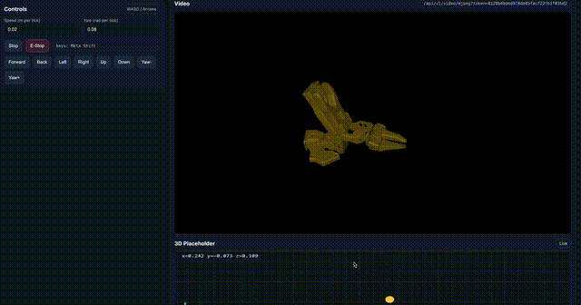

# DeepReach Teleoperation Platform

[](LICENSE)

DeepReach Teleoperation Platform is a cloud-native teleoperation system for the SO-ARM101 robotic arm, designed to bridge the gap between simulation and real-world manipulation. It supports multiple input methods (VR, Keyboard, Joystick) and seamless switching between local and cloud environments.



## 🌟 Key Features

### 🎮 Multi-Modal Inputs
*   **VR Control:** Full 6-DoF control with stereoscopic vision (Quest 3/3S via WebXR).
*   **Keyboard & Mouse:** Accessible browser-based control for quick testing.
*   **Joystick:** Xbox/Gamepad support for intuitive operation.

### 🤖 Supported Hardware
*   **SO-ARM101** (6-DoF) — single arm and dual arm configurations

### 🌍 Simulation & Real World
*   **MuJoCo (Step 1):** Fast, local physics simulation for rapid development and testing.
*   **Isaac Sim (Step 2):** High-fidelity, photorealistic simulation (Local or Cloud via Omniverse Streaming).
*   **Sim-to-Real:** Identical control stack for simulation and physical hardware.

### 📱 Cross-Platform
*   **Server:** Linux (Ubuntu), macOS.
*   **Client:** Any web browser (Desktop, Android, VR headsets).

## 🚀 Scenarios
*   **Research:** Teleoperation data collection for robot learning.
*   **Logistics:** Box sorting and handling (e.g., warehouse return processing).
*   **Remote Operation:** Low-latency control over public internet.

## ⚡ Quick Start

For detailed installation and usage instructions, see the [Quick Start Guide](QUICKSTART.md).

### 1. Install
```bash
git clone https://github.com/deepreach-ai/DRT.git
cd DRT
pip install -r server/requirements.txt
```

### 2. Start the Unified FastAPI Server
Runs Web UI and API on a single port.
```bash
# Mock backend (no hardware)
python3 run_server.py --backend mock

# MuJoCo simulation (SO-ARM101)
python3 run_server.py --backend mujoco \
  --mujoco-xml robots/so101/so101.xml \
  --mujoco-ee gripperframe

# Isaac Sim backend
python3 run_server.py --backend isaac
```

### 3. Open the Web Client
Visit:
```
http://localhost:8000/web/
```
Login (default):
- Username: operator
- Password: operator

### 4. Server Health Check
```bash
curl http://localhost:8000/api/v1/statistics | python3 -m json.tool
```
Expected fields include:
- backend: mujoco/mock/isaac/soarm
- status: connected
- current_position / orientation statistics

### 5. Keyboard Control
- Web UI supports XYZ translation + yaw rotation
- Python client supports full 6-DoF

References:
- Docs: [Keyboard Controls](docs/KEYBOARD_CONTROLS.md)
- Python client: `python3 client/keyboard_client.py`

## 🥽 VR Teleoperation (Meta Quest 3)

The VR client uses WebXR and sends 50 Hz control deltas over WebSocket.

### Modes
- Single Arm: `?urdf=so101`
- Dual Arm: `?urdf=so101_dual`

### Connect Over Wi‑Fi
1. Put the Quest 3 and your computer on the same network.
2. Open the Quest Browser.
3. Navigate to:
   - `http://<host-ip>:8000/web/vr.html?urdf=so101`
4. Login (operator/operator), click "Enter VR Mode".

### Wired USB (ADB Reverse)
Lowest latency and easy local access:
```bash
adb devices                # verify headset connection
adb reverse tcp:8000 tcp:8000
```
Open on the headset:
```
http://localhost:8000/web/vr.html?urdf=so101
```

### HTTPS/WSS (Optional Secure Context)
Some headset/browser setups prefer HTTPS for WebXR:
```bash
./generate_cert.sh
python3 run_server.py --backend soarm --soarm-port /dev/tty.usbmodemXXXX \
  --port 8443 --ssl-key key.pem --ssl-cert cert.pem
adb reverse tcp:8443 tcp:8443
```
Open:
```
https://localhost:8443/web/vr.html?urdf=so101
```
Accept the self-signed certificate warning.

### Dual-Arm Launch
```bash
export TELEOP_BACKEND=so101_dual
export TELEOP_LEFT_PORT=/dev/tty.usbmodemLEFT
export TELEOP_RIGHT_PORT=/dev/tty.usbmodemRIGHT
python3 server/teleop_server.py --port 8000
```
Open:
```
http://<host-ip>:8000/web/vr.html?urdf=so101_dual
```

### Controls
- Grip (hold): clutch for direct 6‑DoF hand deltas
- Right joystick: rate-based movement when clutch not held
- Right trigger: gripper open/close
- B button: exit VR

### Video Streams
- Generic MJPEG: `/api/v1/video/mjpeg?token=...`
- Per camera MJPEG: `/api/v1/video/{camera_name}/mjpeg?token=...` where camera_name is `left`, `right`, `depth`

Note: login first to receive an auth token used by the video endpoints.

### Startup Scripts
- SO-ARM101 (sim): `./start_so101_vr_sim.sh`
- SO-ARM101 (real): `./start_so101_vr_real.sh`
- Dual SO-ARM101: `./start_dual_so101_vr.sh`

## 📚 Documentation

Detailed guides can be found in the `docs/` directory:

*   **Setup:** [VR Setup](docs/VR_SETUP.md), [SO-ARM Setup](docs/SOARM_SETUP.md), [Ngrok (Remote Access)](docs/NGROK_SETUP.md)
*   **Operation:** [Keyboard Controls](docs/KEYBOARD_CONTROLS.md), [Quest 3 Sync Guide](docs/QUEST3_SYNC_GUIDE.md)
*   **Deployment:** [AWS Deployment](docs/AWS_DEPLOYMENT_GUIDE.md), [Isaac Sim Workflow](docs/ISAAC_SIM_WORKFLOW.md)
*   **Validation:** [Latency Testing](docs/LATENCY_TEST_GUIDE.md), [Local Validation](docs/LOCAL_VALIDATION_GUIDE.md)

## 📄 License

This project is licensed under the Apache License 2.0 - see the [LICENSE](LICENSE) file for details.

## 🙏 Acknowledgements

*   **NVIDIA:** For Isaac Sim and investment support.
*   **OpenTelevision:** For inspiration on teleoperation frameworks.
